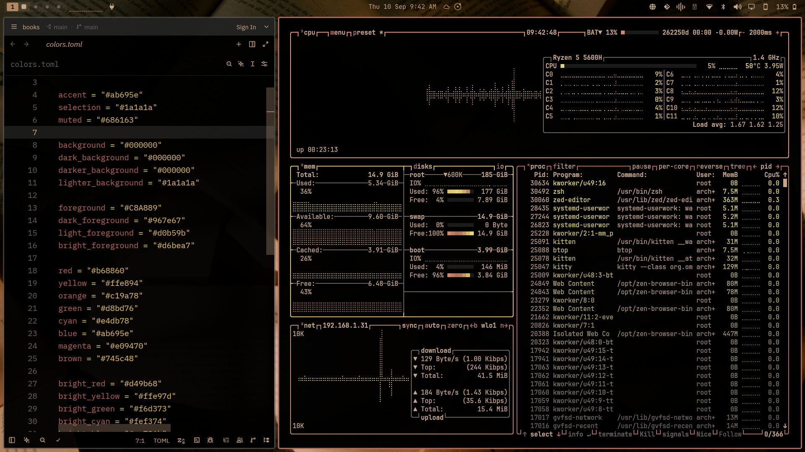
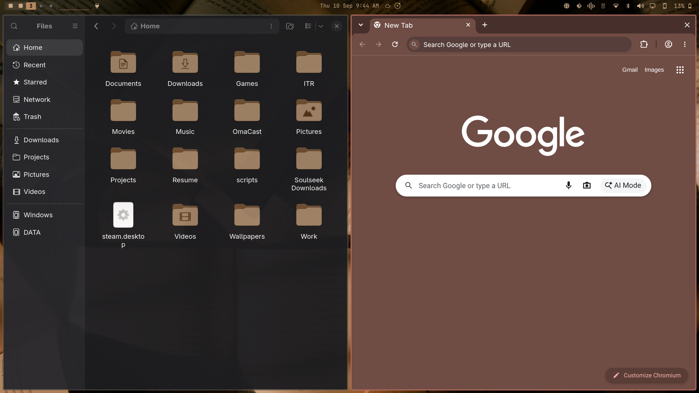
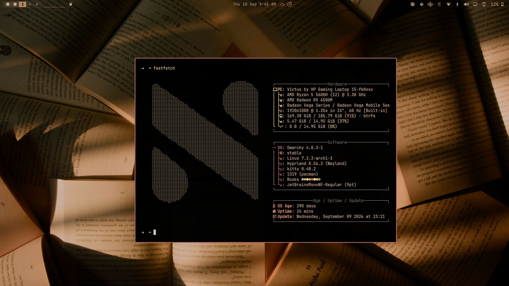

A theme drawn from Homer's epic *The Odyssey* and its [film adaptation](https://www.imdb.com/title/tt33764258) for [Omarchy.org](https://omarchy.org).

## Preview

<p align="center">
  
</p>
<p align="center">
  
</p>
<p align="center">
  
</p>

## Wallpapers

<p align="center">
  
  
  
</p>
<p align="center">
  
  
</p>

## Installation

To install this theme:

```bash
omarchy-theme-install https://github.com/Nirmal314/omarchy-books-theme
```

## Compatibility

This theme includes configurations for:

- **Terminal Emulators**: Alacritty, Foot, Ghostty, Kitty
- **Window Manager**: Hyprland, Hyprlock
- **Bar**: Waybar
- **Application Launcher**: Wofi, Walker
- **Notification Daemon**: Mako
- **Editor**: Neovim, Zed
- **System Monitor**: btop
- **Browser**: Chromium
- **Other**: Zellij, Vencord, SwayOSD, Warp

## Color Palette

<table>
  <tr>
    <td align="center" width="20"><rect width='16' height='16' fill='%23ab695e'/></svg>"><br><sub>Accent<br><code>#ab695e</code></sub></td>
    <td align="center" width="20"><rect width='16' height='16' fill='%231a1a1a'/></svg>"><br><sub>Selection<br><code>#1a1a1a</code></sub></td>
    <td align="center" width="20"><rect width='16' height='16' fill='%23686163'/></svg>"><br><sub>Muted<br><code>#686163</code></sub></td>
    <td align="center" width="20"><rect width='16' height='16' fill='%23000000'/></svg>"><br><sub>Background<br><code>#000000</code></sub></td>
    <td align="center" width="20"><rect width='16' height='16' fill='%231a1a1a'/></svg>"><br><sub>Lighter BG<br><code>#1a1a1a</code></sub></td>
  </tr>
  <tr>
    <td align="center" width="20"><rect width='16' height='16' fill='%23C8A889'/></svg>"><br><sub>Foreground<br><code>#C8A889</code></sub></td>
    <td align="center" width="20"><rect width='16' height='16' fill='%23967e67'/></svg>"><br><sub>Dark FG<br><code>#967e67</code></sub></td>
    <td align="center" width="20"><rect width='16' height='16' fill='%23d0b59b'/></svg>"><br><sub>Light FG<br><code>#d0b59b</code></sub></td>
    <td align="center" width="20"><rect width='16' height='16' fill='%23d6bea7'/></svg>"><br><sub>Bright FG<br><code>#d6bea7</code></sub></td>
    <td align="center" width="20"></td>
  </tr>
  <tr>
    <td align="center"><rect width='16' height='16' fill='%23b68860'/></svg>"><br><sub>Red<br><code>#b68860</code></sub></td>
    <td align="center"><rect width='16' height='16' fill='%23d8bd76'/></svg>"><br><sub>Green<br><code>#d8bd76</code></sub></td>
    <td align="center"><rect width='16' height='16' fill='%23ffe894'/></svg>"><br><sub>Yellow<br><code>#ffe894</code></sub></td>
    <td align="center"><rect width='16' height='16' fill='%23ab695e'/></svg>"><br><sub>Blue<br><code>#ab695e</code></sub></td>
    <td align="center"><rect width='16' height='16' fill='%23e09470'/></svg>"><br><sub>Magenta<br><code>#e09470</code></sub></td>
  </tr>
  <tr>
    <td align="center"><rect width='16' height='16' fill='%23c19a78'/></svg>"><br><sub>Orange<br><code>#c19a78</code></sub></td>
    <td align="center"><rect width='16' height='16' fill='%23e4db78'/></svg>"><br><sub>Cyan<br><code>#e4db78</code></sub></td>
    <td align="center"><rect width='16' height='16' fill='%23745c48'/></svg>"><br><sub>Brown<br><code>#745c48</code></sub></td>
    <td align="center"><rect width='16' height='16' fill='%23d49b68'/></svg>"><br><sub>Bright Red<br><code>#d49b68</code></sub></td>
    <td align="center"><rect width='16' height='16' fill='%23f6d373'/></svg>"><br><sub>Bright Green<br><code>#f6d373</code></sub></td>
  </tr>
  <tr>
    <td align="center"><rect width='16' height='16' fill='%23ffe97d'/></svg>"><br><sub>Bright Yellow<br><code>#ffe97d</code></sub></td>
    <td align="center"><rect width='16' height='16' fill='%23ca796b'/></svg>"><br><sub>Bright Blue<br><code>#ca796b</code></sub></td>
    <td align="center"><rect width='16' height='16' fill='%23ffa375'/></svg>"><br><sub>Bright Magenta<br><code>#ffa375</code></sub></td>
    <td align="center"><rect width='16' height='16' fill='%23fef374'/></svg>"><br><sub>Bright Cyan<br><code>#fef374</code></sub></td>
    <td align="center"></td>
  </tr>
</table>